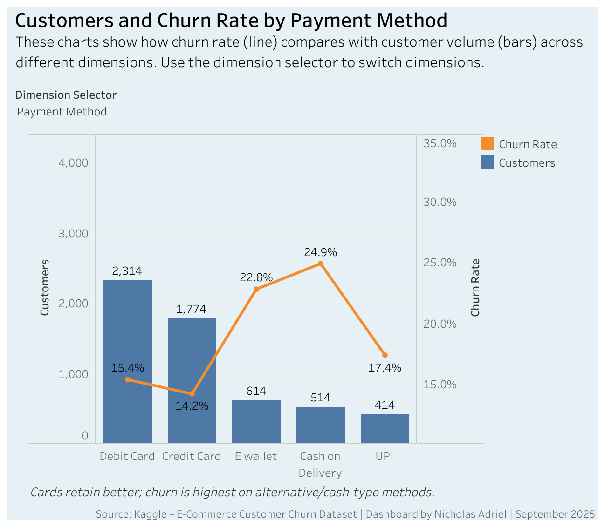
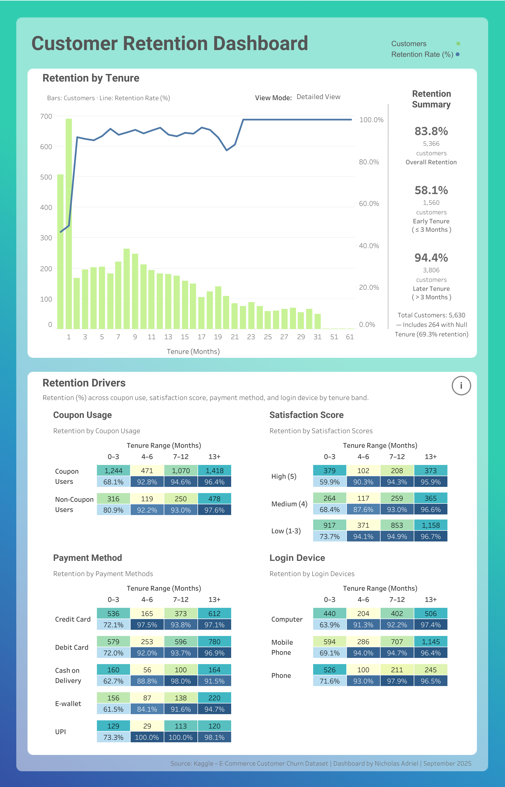
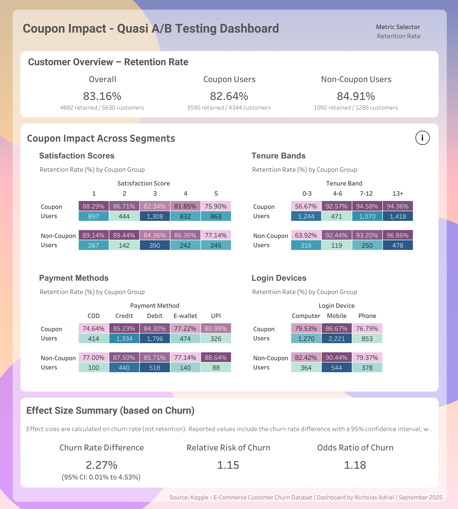

# ecommerce-churn-analytics

## Project Overview

This project explores **customer churn and retention** for an e-commerce platform.  
Using **SQL** for data transformation and **Tableau** for visualization, I analyzed customer behavior, retention by tenure, and conducted a **quasi A/B test** on coupon usage.

The analysis highlights key retention drivers and provides data-driven insights for customer engagement strategies.

---

## Tools & Technologies

- PostgreSQL – Data queries & churn/retention metrics

- Tableau – Dashboards & interactive visualizations

- Dataset – [E-Commerce Customer Churn Dataset (Kaggle)](https://www.kaggle.com/datasets/anaghapaul/e-commerce-dataset/data)  

---

## Repository Contents
```bash
ecommerce-churn-analytics/
│
├── data/
│   └── E-Commerce Churn Data.csv
│
├── sql/
│   ├── exploration.sql
│   ├── customers_retention.sql
│   └── quasi_a_b_test_coupon.sql
│
├── images/
│   ├── churn_rate_analysis.png
│   ├── customer_retention.png
│   └── coupon_impact.png
│
└── README.md
```
---

## Dashboards

### Churn Rate Analysis
Bars show customer volume, line shows churn rate (%) across segments.  

[View on Tableau Public](https://public.tableau.com/views/churnrateanalysis_17581690049940/FinalDashboard?:language=en-US&:sid=&:redirect=auth&:display_count=n&:origin=viz_share_link)  

**Preview:**
 

### Customer Retention Dashboard
Retention by tenure, coupon usage, satisfaction, payment method, and login device.  

[View on Tableau Public](https://public.tableau.com/views/CustomerRetentionDashboard_17592001046600/Dashboard1?:language=en-US&:sid=&:redirect=auth&:display_count=n&:origin=viz_share_link)  

**Preview:**


### Coupon Impact – Quasi A/B Testing  
Compares coupon vs. non-coupon users with churn/retention toggle.  

[View on Tableau Public](https://public.tableau.com/views/CouponImpactQuasiABTesting/Dashboard1?:language=en-US&:sid=&:redirect=auth&:display_count=n&:origin=viz_share_link)  

**Preview:**


Explore more of my work on [Tableau Public](https://public.tableau.com/app/profile/nicholas.adriel/vizzes).

---

## Key Insights
- Retention improves with customer tenure — stabilizing at ~94% after 3 months.  
- Coupon users showed slightly higher churn compared to non-coupon users.  
- Payment methods matter: alternative/cash-type methods had the highest churn.  
- Effect size metrics confirm coupon impact:  
  - Churn Rate Difference: 2.27% (95% CI: 0.01%–4.53%)  
  - Relative Risk of Churn: 1.15  
  - Odds Ratio of Churn: 1.18  

---

## How to Use

1. Clone the repo
    ```bash
    git clone https://github.com/nicho889/ecommerce-churn-analytics.git
    ```
2. Run the SQL files in PostgreSQL

3. Explore dashboards via Tableau Public links 

---

## License

Released under the MIT License – feel free to use and adapt.
